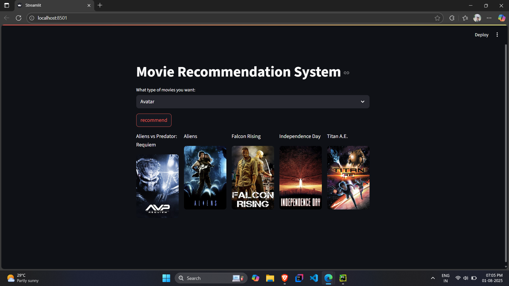

# 🎬 Movie Recommendation System

This is a content-based movie recommendation system built using Streamlit. Given a movie name, it recommends five similar movies by leveraging cosine similarity on movie features. Posters and titles are fetched dynamically using the TMDB API.

🔗 **Live Demo:** [Movie Recommendation System](https://movierecommendationsystem-rlyq.onrender.com/)

---

## 📦 Dataset

We use metadata from the [TMDB 5000 Movie Dataset](https://www.kaggle.com/datasets/tmdb/tmdb-movie-metadata).

---

## 📁 Pretrained Files

Two essential pre-computed `.pkl` files are required to run the app:

- [`movie_dict.pkl`](https://huggingface.co/spaces/Princebhalse92/movie-model-files/resolve/main/movie_dict.pkl)
- [`similarity.pkl`](https://huggingface.co/spaces/Princebhalse92/movie-model-files/resolve/main/similarity.pkl)

Download and place them in the same directory as `app.py`.

---

## 🚀 How to Run the App Locally

### 1. Clone the Repository

```bash
git clone <your-repo-url>
cd <project-folder>
```

### 2. Install Requirements

```bash
pip install -r requirements.txt
```

### 3. Add TMDB API Key

Create a `.env` file in the root folder and add your TMDB API key:

```env
TMDB_API_KEY=your_tmdb_api_key_here
```

You can obtain a free API key from: https://www.themoviedb.org/settings/api

---

## 🏃 Run the App

```bash
streamlit run app.py
```

The app will open in your browser. Select a movie from the dropdown and click **recommend** to see suggestions along with posters.

---

## 🛠️ Tech Stack

- **Frontend:** Streamlit
- **Backend:** Python
- **Libraries:** Pandas, Scikit-learn, Requests, dotenv
- **Deployment:** Hosted on Render

---

## 👤 Author

**Prince Bhalse**

---

## 📄 License

Open Source.

   

